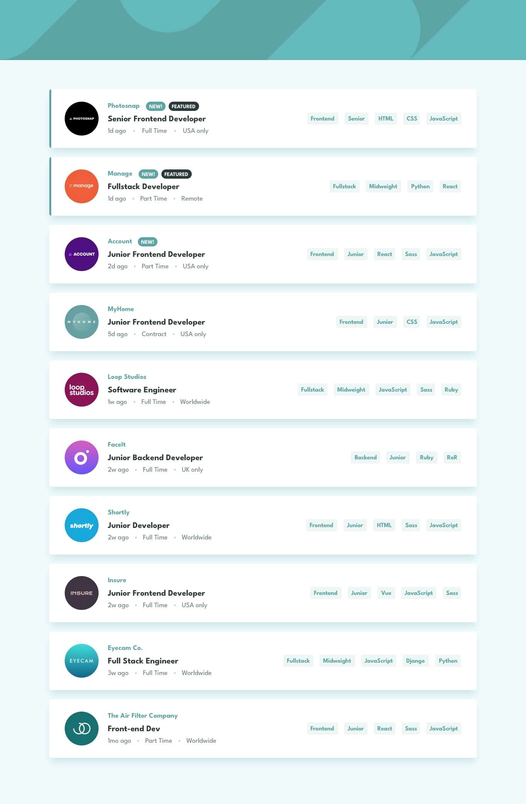

# Frontend Mentor - Job listings with filtering

## Welcome! 👋

Hello! Thanks for cheking out this repository.

## What is it about

It's a solution of a junior challange called "Job listings with filtering" made by Frontend Mentor.

Here is the link of the challange-
https://www.frontendmentor.io/challenges/intro-section-with-dropdown-navigation-ryaPetHE5

Here is Demo -
https://vantuan0101-job-listing.netlify.app/

Source code : https://github.com/vantuan0101/job-listing

You can see my POST on Fontend Mentor : https://www.frontendmentor.io/challenges/job-listings-with-filtering-ivstIPCt/hub/using-tailwindcss-react-javascript-9ISYn20QTk

## Built with

-HTML

-TailwindCSS 

-Javascript

-ReactJS

## Author

Facebook -[Văn Tuấn] https://www.facebook.com/vantuan0101

Frontend Mentor - https://www.frontendmentor.io/profile/vantuan0101

### Any suggestion

I would be glad and greatful if you could leave any suggestion for this project or about anything else. Have a good day :)
